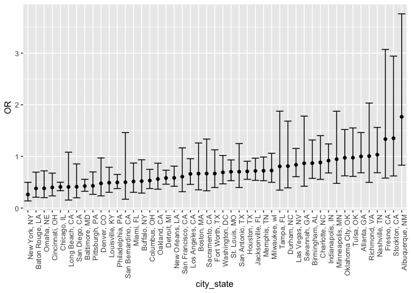
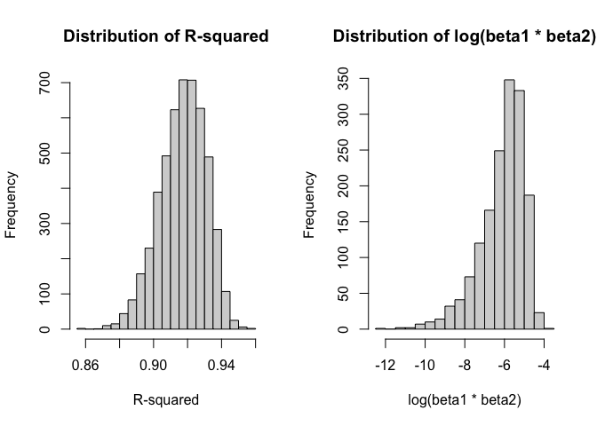
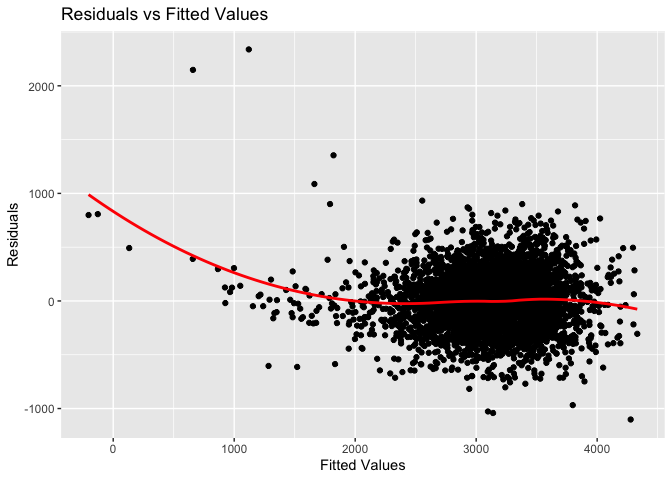
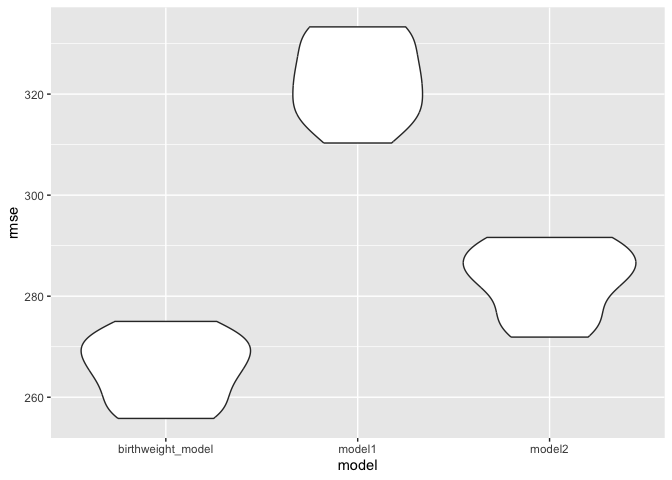

p8105_jx2562_hw6
================
Jingyi
2023-12-02

## Problem 1

Load library and dataset

``` r
library(tidyverse)
library(broom)
```

Filter the data:

1.  Create two new variables `city_state` and `solved`.

2.  Ignore some data points with bad quality

3.  Ensure the `victim_age` variable as numeric variable and omit NAs.

``` r
homicide_df = 
  read_csv("data/homicide-data.csv", na = c("", "NA", "Unknown")) |> 
  mutate(
    city_state = str_c(city, state, sep = ", "),
    victim_age = as.numeric(victim_age),
    resolution = case_when(
      disposition == "Closed without arrest" ~ 0,
      disposition == "Open/No arrest"        ~ 0,
      disposition == "Closed by arrest"      ~ 1)
  ) |> 
  filter(victim_race %in% c("White", "Black")) |> 
  filter(!(city_state %in% c("Tulsa, AL", "Dallas, TX", "Phoenix, AZ", "Kansas City, MO"))) |> 
  select(city_state, resolution, victim_age, victim_sex, victim_race)
```

    ## Rows: 52179 Columns: 12
    ## ── Column specification ────────────────────────────────────────────────────────
    ## Delimiter: ","
    ## chr (8): uid, victim_last, victim_first, victim_race, victim_sex, city, stat...
    ## dbl (4): reported_date, victim_age, lat, lon
    ## 
    ## ℹ Use `spec()` to retrieve the full column specification for this data.
    ## ℹ Specify the column types or set `show_col_types = FALSE` to quiet this message.

Apply a function to fit logistic regression and extract OR and CI for
Baltimore, MD

``` r
baltimore_glm = 
  filter(homicide_df, city_state == "Baltimore, MD") |> 
  glm(resolution ~ victim_age + victim_sex + victim_race, family = binomial(), data = _)

baltimore_glm |> 
  broom::tidy() |> 
  mutate(
    OR = exp(estimate), 
    OR_CI_upper = exp(estimate + 1.96 * std.error),
    OR_CI_lower = exp(estimate - 1.96 * std.error)) |> 
  filter(term == "victim_sexMale") |> 
  select(OR, OR_CI_lower, OR_CI_upper) |>
  knitr::kable(digits = 3)
```

|    OR | OR_CI_lower | OR_CI_upper |
|------:|------------:|------------:|
| 0.426 |       0.325 |       0.558 |

Apply the function to other city

``` r
model_results = 
  homicide_df |> 
  nest(data = -city_state) |> 
  mutate(
    models = map(data, \(df) glm(resolution ~ victim_age + victim_sex + victim_race, 
                             family = binomial(), data = df)),
    tidy_models = map(models, broom::tidy)) |> 
  select(-models, -data) |> 
  unnest(cols = tidy_models) |> 
  mutate(
    OR = exp(estimate), 
    OR_CI_upper = exp(estimate + 1.96 * std.error),
    OR_CI_lower = exp(estimate - 1.96 * std.error)) |> 
  filter(term == "victim_sexMale") |> 
  select(city_state, OR, OR_CI_lower, OR_CI_upper)

model_results |>
  slice(1:5) |> 
  knitr::kable(digits = 3)
```

| city_state      |    OR | OR_CI_lower | OR_CI_upper |
|:----------------|------:|------------:|------------:|
| Albuquerque, NM | 1.767 |       0.831 |       3.761 |
| Atlanta, GA     | 1.000 |       0.684 |       1.463 |
| Baltimore, MD   | 0.426 |       0.325 |       0.558 |
| Baton Rouge, LA | 0.381 |       0.209 |       0.695 |
| Birmingham, AL  | 0.870 |       0.574 |       1.318 |

Make the plot

Below we generate a plot of the estimated ORs and CIs for each city,
ordered by magnitude of the OR from smallest to largest. From this plot
we see that most cities have odds ratios that are smaller than 1,
suggesting that crimes with male victims have smaller odds of resolution
compared to crimes with female victims after adjusting for victim age
and race. This disparity is strongest in New yrok. In roughly half of
these cities, confidence intervals are narrow and do not contain 1,
suggesting a significant difference in resolution rates by sex after
adjustment for victim age and race.

``` r
model_results |> 
  mutate(city_state = fct_reorder(city_state, OR)) |> 
  ggplot(aes(x = city_state, y = OR)) + 
  geom_point() + 
  geom_errorbar(aes(ymin = OR_CI_lower, ymax = OR_CI_upper)) + 
  theme(axis.text.x = element_text(angle = 90, hjust = 1))
```

<!-- -->

## Problem 2

``` r
library(rnoaa)
```

    ## The rnoaa package will soon be retired and archived because the underlying APIs have changed dramatically. The package currently works but does not pull the most recent data in all cases. A noaaWeather package is planned as a replacement but the functions will not be interchangeable.

``` r
library(boot)
```

Extract weather data

``` r
weather_df <- 
  rnoaa::meteo_pull_monitors(
    c("USW00094728"),
    var = c("PRCP", "TMIN", "TMAX"), 
    date_min = "2022-01-01",
    date_max = "2022-12-31") |>
  mutate(
    name = recode(id, USW00094728 = "CentralPark_NY"),
    tmin = tmin / 10,
    tmax = tmax / 10) |>
  select(name, id, everything())
```

    ## using cached file: /Users/xujingyi/Library/Caches/org.R-project.R/R/rnoaa/noaa_ghcnd/USW00094728.dly

    ## date created (size, mb): 2023-09-28 10:21:06.470919 (8.524)

    ## file min/max dates: 1869-01-01 / 2023-09-30

Define the regression function

``` r
regression_function <- function(data, indices) {
  sampled_data <- data[indices, ]
  fit <- lm(tmax ~ tmin + prcp, data = sampled_data)
  rsquared <- broom::glance(fit)$r.squared
  log_beta_product <- log(broom::tidy(fit)$estimate[2] * broom::tidy(fit)$estimate[3])
  c(rsquared, log_beta_product)
}
```

Perform bootstrap

``` r
set.seed(123)

bootstrap_results <- boot(data = weather_df, statistic = regression_function, R = 5000)
```

A lot of NAs occurs in this process, which is produced by a negative
value in the estimate of either beta1 or beta2. When computing log
transformation, the negative value will result in a NA.

Result interpretation by plotting the distribution of R-square and
log(beta1 \* beta2).

``` r
par(mfrow = c(1, 2))
hist(bootstrap_results$t[, 1], main = "Distribution of R-squared", xlab = "R-squared")
hist(bootstrap_results$t[, 2], main = "Distribution of log(beta1 * beta2)", xlab = "log(beta1 * beta2)")
```

<!-- --> As
we can see from the plot, the R-squared value mainly condensed around
0.92. A R-square value larger than 0.9 usually implies a good estimation
of the data. For log(beta1 \* beta2), all values are distributed
negatively, which presents that beta1\*beta2 \< 1.

Compute 95% confidence interval and Print the confidence intervals

``` r
quantiles_rsquare <- quantile(bootstrap_results$t[, 1], c(0.025, 0.975), dimnames = FALSE, na.rm = T)
quantiles_log_beta_product <- quantile(bootstrap_results$t[, 2], c(0.025, 0.975), dimnames = FALSE, na.rm = T)
ci_rsquared <- quantiles_rsquare
ci_log_beta_product <- quantiles_log_beta_product
cat("95% Confidence Interval for R-squared:", ci_rsquared, "\n")
```

    ## 95% Confidence Interval for R-squared: 0.8886348 0.9403299

``` r
cat("95% Confidence Interval for log(beta1 * beta2):", ci_log_beta_product, "\n")
```

    ## 95% Confidence Interval for log(beta1 * beta2): -8.957548 -4.551465

In conclusion, this code defines a regression function and then uses the
boot function to perform the bootstrap procedure. It calculates the
R-squared and log of the product of the estimated coefficients for each
bootstrap sample. The resulting distributions are plotted, and 95%
confidence intervals are computed for both quantities of interest.

## Problem 3

``` r
library(modelr)
library(mgcv)
```

Load data and convert to some variables to factors

``` r
birthweight_data <- read_csv("data/birthweight.csv") |>
  mutate(
    babysex = factor(babysex, levels = c(1, 2), labels = c("male", "female")),
    frace = factor(frace, levels = c(1, 2, 3, 4, 8, 9), labels = c("White", "Black", "Asian", "Puerto Rican", "Other", "Unknown")),
    mrace = factor(mrace, levels = c(1, 2, 3, 4, 8), labels = c("White", "Black", "Asian", "Puerto Rican", "Other")),
    malform = factor(malform),
    smoken = factor(smoken),
    parity = factor(parity),
    pnumlbw = factor(pnumlbw),
    pnumsga = factor(pnumsga)
  )
```

    ## Rows: 4342 Columns: 20
    ## ── Column specification ────────────────────────────────────────────────────────
    ## Delimiter: ","
    ## dbl (20): babysex, bhead, blength, bwt, delwt, fincome, frace, gaweeks, malf...
    ## 
    ## ℹ Use `spec()` to retrieve the full column specification for this data.
    ## ℹ Specify the column types or set `show_col_types = FALSE` to quiet this message.

Check for missing data

``` r
summary(is.na(birthweight_data))
```

    ##   babysex          bhead          blength           bwt         
    ##  Mode :logical   Mode :logical   Mode :logical   Mode :logical  
    ##  FALSE:4342      FALSE:4342      FALSE:4342      FALSE:4342     
    ##    delwt          fincome          frace          gaweeks       
    ##  Mode :logical   Mode :logical   Mode :logical   Mode :logical  
    ##  FALSE:4342      FALSE:4342      FALSE:4342      FALSE:4342     
    ##   malform         menarche        mheight          momage       
    ##  Mode :logical   Mode :logical   Mode :logical   Mode :logical  
    ##  FALSE:4342      FALSE:4342      FALSE:4342      FALSE:4342     
    ##    mrace           parity         pnumlbw         pnumsga       
    ##  Mode :logical   Mode :logical   Mode :logical   Mode :logical  
    ##  FALSE:4342      FALSE:4342      FALSE:4342      FALSE:4342     
    ##    ppbmi            ppwt           smoken          wtgain       
    ##  Mode :logical   Mode :logical   Mode :logical   Mode :logical  
    ##  FALSE:4342      FALSE:4342      FALSE:4342      FALSE:4342

``` r
summary(birthweight_data)
```

    ##    babysex         bhead          blength           bwt           delwt      
    ##  male  :2230   Min.   :21.00   Min.   :20.00   Min.   : 595   Min.   : 86.0  
    ##  female:2112   1st Qu.:33.00   1st Qu.:48.00   1st Qu.:2807   1st Qu.:131.0  
    ##                Median :34.00   Median :50.00   Median :3132   Median :143.0  
    ##                Mean   :33.65   Mean   :49.75   Mean   :3114   Mean   :145.6  
    ##                3rd Qu.:35.00   3rd Qu.:51.00   3rd Qu.:3459   3rd Qu.:157.0  
    ##                Max.   :41.00   Max.   :63.00   Max.   :4791   Max.   :334.0  
    ##                                                                              
    ##     fincome               frace         gaweeks      malform     menarche    
    ##  Min.   : 0.00   White       :2123   Min.   :17.70   0:4327   Min.   : 0.00  
    ##  1st Qu.:25.00   Black       :1911   1st Qu.:38.30   1:  15   1st Qu.:12.00  
    ##  Median :35.00   Asian       :  46   Median :39.90            Median :12.00  
    ##  Mean   :44.11   Puerto Rican: 248   Mean   :39.43            Mean   :12.51  
    ##  3rd Qu.:65.00   Other       :  14   3rd Qu.:41.10            3rd Qu.:13.00  
    ##  Max.   :96.00   Unknown     :   0   Max.   :51.30            Max.   :19.00  
    ##                                                                              
    ##     mheight          momage              mrace      parity   pnumlbw  pnumsga 
    ##  Min.   :48.00   Min.   :12.0   White       :2147   0:4339   0:4342   0:4342  
    ##  1st Qu.:62.00   1st Qu.:18.0   Black       :1909   1:   1                    
    ##  Median :63.00   Median :20.0   Asian       :  43   3:   1                    
    ##  Mean   :63.49   Mean   :20.3   Puerto Rican: 243   6:   1                    
    ##  3rd Qu.:65.00   3rd Qu.:22.0   Other       :   0                             
    ##  Max.   :77.00   Max.   :44.0                                                 
    ##                                                                               
    ##      ppbmi            ppwt           smoken         wtgain      
    ##  Min.   :13.07   Min.   : 70.0   0      :2552   Min.   :-46.00  
    ##  1st Qu.:19.53   1st Qu.:110.0   20     : 297   1st Qu.: 15.00  
    ##  Median :21.03   Median :120.0   10     : 293   Median : 22.00  
    ##  Mean   :21.57   Mean   :123.5   3      : 144   Mean   : 22.08  
    ##  3rd Qu.:22.91   3rd Qu.:134.0   1      : 142   3rd Qu.: 28.00  
    ##  Max.   :46.10   Max.   :287.0   2      : 141   Max.   : 89.00  
    ##                                  (Other): 773

From the result we can see there’s no missing data. We continue our
model building process.

We construct a MLR model in spite of the variables with only one level,
which are `pnumlbw` and `pnumsga`.

``` r
# Model Building
birthweight_model <- lm(bwt ~ babysex + bhead + blength + delwt + fincome + frace + gaweeks +
                          malform + menarche + mheight + momage + mrace + parity + ppbmi + ppwt + smoken + wtgain, data = birthweight_data)

# Summary of the model
summary(birthweight_model)
```

    ## 
    ## Call:
    ## lm(formula = bwt ~ babysex + bhead + blength + delwt + fincome + 
    ##     frace + gaweeks + malform + menarche + mheight + momage + 
    ##     mrace + parity + ppbmi + ppwt + smoken + wtgain, data = birthweight_data)
    ## 
    ## Residuals:
    ##      Min       1Q   Median       3Q      Max 
    ## -1101.98  -181.78    -3.11   169.41  2338.37 
    ## 
    ## Coefficients: (1 not defined because of singularities)
    ##                     Estimate Std. Error t value Pr(>|t|)    
    ## (Intercept)       -6.362e+03  6.615e+02  -9.617  < 2e-16 ***
    ## babysexfemale      2.863e+01  8.493e+00   3.371 0.000756 ***
    ## bhead              1.308e+02  3.462e+00  37.787  < 2e-16 ***
    ## blength            7.488e+01  2.028e+00  36.927  < 2e-16 ***
    ## delwt              4.108e+00  3.957e-01  10.382  < 2e-16 ***
    ## fincome            2.973e-01  1.803e-01   1.649 0.099136 .  
    ## fraceBlack         1.394e+01  4.631e+01   0.301 0.763400    
    ## fraceAsian         1.820e+01  6.929e+01   0.263 0.792828    
    ## fracePuerto Rican -4.522e+01  4.474e+01  -1.011 0.312216    
    ## fraceOther         8.550e+00  7.432e+01   0.115 0.908418    
    ## gaweeks            1.151e+01  1.471e+00   7.822 6.50e-15 ***
    ## malform1          -7.868e+00  7.185e+01  -0.110 0.912799    
    ## menarche          -3.265e+00  2.907e+00  -1.123 0.261411    
    ## mheight            1.142e+01  1.033e+01   1.106 0.268923    
    ## momage             5.289e-01  1.230e+00   0.430 0.667215    
    ## mraceBlack        -1.524e+02  4.617e+01  -3.301 0.000971 ***
    ## mraceAsian        -8.956e+01  7.192e+01  -1.245 0.213070    
    ## mracePuerto Rican -5.911e+01  4.519e+01  -1.308 0.190904    
    ## parity1            3.148e+02  2.736e+02   1.150 0.250072    
    ## parity3            1.998e+02  2.730e+02   0.732 0.464350    
    ## parity6            5.649e+02  2.749e+02   2.055 0.039927 *  
    ## ppbmi              6.825e+00  1.491e+01   0.458 0.647227    
    ## ppwt              -3.896e+00  2.616e+00  -1.489 0.136582    
    ## smoken0.125        2.730e+00  4.399e+01   0.062 0.950527    
    ## smoken0.75        -9.376e+01  4.457e+01  -2.104 0.035473 *  
    ## smoken1            1.891e+01  2.364e+01   0.800 0.423647    
    ## smoken2           -6.066e+00  2.366e+01  -0.256 0.797712    
    ## smoken3           -6.174e-03  2.351e+01   0.000 0.999790    
    ## smoken4           -1.004e+02  2.657e+01  -3.779 0.000160 ***
    ## smoken5           -3.972e+01  2.484e+01  -1.599 0.109917    
    ## smoken6           -2.157e+01  3.540e+01  -0.609 0.542429    
    ## smoken7           -2.824e+01  3.869e+01  -0.730 0.465534    
    ## smoken8           -1.191e+02  3.943e+01  -3.021 0.002534 ** 
    ## smoken9           -8.357e+01  6.125e+01  -1.364 0.172503    
    ## smoken10          -5.985e+01  1.698e+01  -3.525 0.000428 ***
    ## smoken11          -5.215e+01  9.653e+01  -0.540 0.589014    
    ## smoken12          -8.190e+01  7.330e+01  -1.117 0.263922    
    ## smoken13          -1.061e+02  6.466e+01  -1.641 0.100870    
    ## smoken14          -8.034e+01  1.929e+02  -0.417 0.676990    
    ## smoken15          -3.659e+01  2.808e+01  -1.303 0.192552    
    ## smoken16          -1.643e+02  1.363e+02  -1.205 0.228274    
    ## smoken17          -9.301e+01  9.123e+01  -1.019 0.308034    
    ## smoken18          -1.728e+02  6.641e+01  -2.601 0.009319 ** 
    ## smoken19          -1.049e+02  1.364e+02  -0.769 0.442021    
    ## smoken20          -1.194e+02  1.709e+01  -6.988 3.22e-12 ***
    ## smoken22          -1.578e+02  1.928e+02  -0.819 0.413032    
    ## smoken23          -2.824e+02  1.364e+02  -2.071 0.038414 *  
    ## smoken24           2.259e+02  1.963e+02   1.150 0.250041    
    ## smoken25           3.962e+01  7.599e+01   0.521 0.602110    
    ## smoken30          -1.572e+02  4.004e+01  -3.928 8.71e-05 ***
    ## smoken33           1.283e+02  2.726e+02   0.471 0.637810    
    ## smoken35          -5.193e+01  2.726e+02  -0.190 0.848932    
    ## smoken40          -1.190e+02  5.204e+01  -2.287 0.022274 *  
    ## smoken50           2.748e+01  2.728e+02   0.101 0.919753    
    ## smoken60          -1.054e+02  2.729e+02  -0.386 0.699431    
    ## wtgain                    NA         NA      NA       NA    
    ## ---
    ## Signif. codes:  0 '***' 0.001 '**' 0.01 '*' 0.05 '.' 0.1 ' ' 1
    ## 
    ## Residual standard error: 272.2 on 4287 degrees of freedom
    ## Multiple R-squared:  0.721,  Adjusted R-squared:  0.7175 
    ## F-statistic: 205.2 on 54 and 4287 DF,  p-value: < 2.2e-16

Interpretation of the result:

1.  *Coefficients:* here I only interpret some of the coefficients.

\` Intercept: The intercept is -6,362, which represents the estimated
birth weight when all predictor variables are zero.

\` fincome: The coefficient is 0.2973, suggesting a small positive
effect of family monthly income on birth weight, but it’s not
statistically significant (p-value = 0.099).

\` malform1: The presence of malformations (malform1) is associated with
a decrease in birth weight by 7.87 grams, but it’s not statistically
significant.

\` smoken variables: These represent different levels of smoking during
pregnancy. Some of them are highly associated with the outcome, like
smoken4, 10, 20, 30.

2.  *Residuals:*

\` The minimum residual is -1101.98, and the maximum is 2338.37.
Residuals are the differences between observed and predicted values.
These values suggest that the model has some variability in predicting
birth weights.

3.  *Multiple R-squared and Adjusted R-squared:*

\` Multiple R-squared is 0.721, indicating that approximately 72.1% of
the variance in birth weight is explained by the model.

\` Adjusted R-squared (adjusted for the number of predictors) is 0.7175,
which is acceptable for a prediction model.

4.  *F-statistic:*

\` The F-statistic is 205.2, with a very low p-value (\< 2.2e-16),
indicating that the model is statistically significant.

In summary, this model appears to be statistically significant and
explains a substantial portion of the variance in birth weight. However,
we should consider addressing collinearity issues and further examining
the practical significance of the coefficients.

``` r
birthweight_plot <- birthweight_model %>%
  augment() %>%
  ggplot(aes(.fitted, .resid)) +
  geom_point() +
  geom_smooth(se = FALSE, method = "loess", color = "red") +
  labs(title = "Residuals vs Fitted Values", x = "Fitted Values", y = "Residuals")

birthweight_plot
```

    ## `geom_smooth()` using formula = 'y ~ x'

<!-- -->
This plot implies that once the fitted value is over 2000, the value of
residuals stops decreasing significantly and approaches 0. This can give
us the hint of maintaining a high quality of model as well as consuming
a shorter time.

Now, we compare this model to another 2 models by cross validation.

Model 1: Using Length at Birth and Gestational Age as Predictors (Main
Effects Only)

``` r
model1 <- lm(bwt ~ blength + gaweeks, data = birthweight_data)
summary(model1)
```

    ## 
    ## Call:
    ## lm(formula = bwt ~ blength + gaweeks, data = birthweight_data)
    ## 
    ## Residuals:
    ##     Min      1Q  Median      3Q     Max 
    ## -1709.6  -215.4   -11.4   208.2  4188.8 
    ## 
    ## Coefficients:
    ##              Estimate Std. Error t value Pr(>|t|)    
    ## (Intercept) -4347.667     97.958  -44.38   <2e-16 ***
    ## blength       128.556      1.990   64.60   <2e-16 ***
    ## gaweeks        27.047      1.718   15.74   <2e-16 ***
    ## ---
    ## Signif. codes:  0 '***' 0.001 '**' 0.01 '*' 0.05 '.' 0.1 ' ' 1
    ## 
    ## Residual standard error: 333.2 on 4339 degrees of freedom
    ## Multiple R-squared:  0.5769, Adjusted R-squared:  0.5767 
    ## F-statistic:  2958 on 2 and 4339 DF,  p-value: < 2.2e-16

Model 2:

``` r
model2 <- lm(bwt ~ bhead * blength * babysex, data = birthweight_data)
summary(model2)
```

    ## 
    ## Call:
    ## lm(formula = bwt ~ bhead * blength * babysex, data = birthweight_data)
    ## 
    ## Residuals:
    ##      Min       1Q   Median       3Q      Max 
    ## -1132.99  -190.42   -10.33   178.63  2617.96 
    ## 
    ## Coefficients:
    ##                               Estimate Std. Error t value Pr(>|t|)    
    ## (Intercept)                 -7176.8170  1264.8397  -5.674 1.49e-08 ***
    ## bhead                         181.7956    38.0542   4.777 1.84e-06 ***
    ## blength                       102.1269    26.2118   3.896 9.92e-05 ***
    ## babysexfemale                6374.8684  1677.7669   3.800 0.000147 ***
    ## bhead:blength                  -0.5536     0.7802  -0.710 0.478012    
    ## bhead:babysexfemale          -198.3932    51.0917  -3.883 0.000105 ***
    ## blength:babysexfemale        -123.7729    35.1185  -3.524 0.000429 ***
    ## bhead:blength:babysexfemale     3.8781     1.0566   3.670 0.000245 ***
    ## ---
    ## Signif. codes:  0 '***' 0.001 '**' 0.01 '*' 0.05 '.' 0.1 ' ' 1
    ## 
    ## Residual standard error: 287.7 on 4334 degrees of freedom
    ## Multiple R-squared:  0.6849, Adjusted R-squared:  0.6844 
    ## F-statistic:  1346 on 7 and 4334 DF,  p-value: < 2.2e-16

Comparison by cross validation

``` r
cv_df = crossv_mc(birthweight_data, 10)|>
  mutate(
    train = map(train, as_tibble),
    test = map(test, as_tibble))

cv_df = 
  cv_df |> 
  mutate(
    birthweight_model  = map(train, \(birthweight_data) birthweight_model),
    model1  = map(train, \(birthweight_data) model1),
    model2  = map(train, \(birthweight_data) model2)) |> 
  mutate(
    rmse_birthweight_model = map2_dbl(birthweight_model, test, \(mod, birthweight_data) rmse(model = mod, data = birthweight_data)),
    rmse_model1 = map2_dbl(model1, test, \(mod, birthweight_data) rmse(model = mod, data = birthweight_data)),
    rmse_model2 = map2_dbl(model2, test, \(mod, birthweight_data) rmse(model = mod, data = birthweight_data)))
```

    ## Warning: There were 10 warnings in `mutate()`.
    ## The first warning was:
    ## ℹ In argument: `rmse_birthweight_model = map2_dbl(...)`.
    ## Caused by warning in `predict.lm()`:
    ## ! prediction from rank-deficient fit; attr(*, "non-estim") has doubtful cases
    ## ℹ Run `dplyr::last_dplyr_warnings()` to see the 9 remaining warnings.

Make the comparison calculating the mean of the three models’ rmse from
cross validation.

``` r
mean_birthweight_model = cv_df |>
  pull(rmse_birthweight_model) |>
  mean()
cat("The CV result for birthwight_model:",mean_birthweight_model,"\n")
```

    ## The CV result for birthwight_model: 265.6622

``` r
mean_model1 = cv_df |>
  pull(rmse_model1) |>
  mean()
cat("The CV result for model1:",mean_model1,"\n")
```

    ## The CV result for model1: 322.7929

``` r
mean_model2 = cv_df |>
  pull(rmse_model2) |>
  mean()
cat("The CV result for model2:",mean_model2,"\n")
```

    ## The CV result for model2: 283.2998

From the results, we can see our initial model has the best performance
in RMSE derived from 10-fold CV.

Visualization are given below.

``` r
cv_df |> 
  select(starts_with("rmse")) |> 
  pivot_longer(
    everything(),
    names_to = "model", 
    values_to = "rmse",
    names_prefix = "rmse_") |> 
  mutate(model = fct_inorder(model)) |> 
  ggplot(aes(x = model, y = rmse)) + geom_violin()
```

<!-- -->
